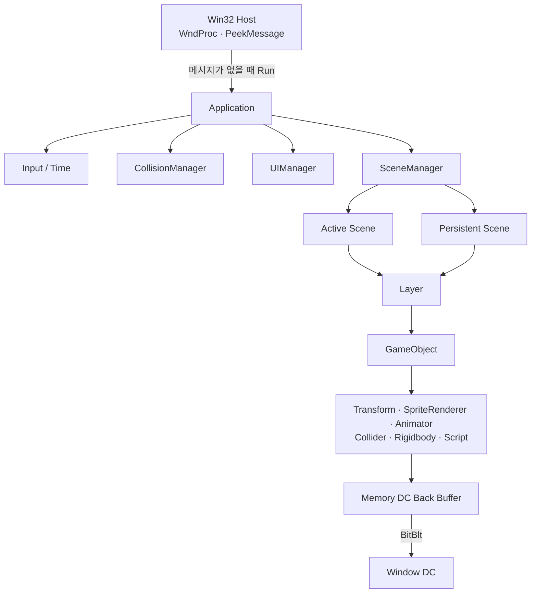

# MyEngineW — WinAPI 2D Game Engine

<p align="center">
  <b>Win32 API와 GDI/GDI+를 기반으로 게임 루프, 객체 구조, 렌더링, 애니메이션, 물리·충돌을 직접 구현한 2D 게임 엔진</b>
</p>

<p align="center">
  
  
  
  
  
</p>

---

## 프로젝트 소개

`MyEngineW`는 상용 엔진의 기능을 단순히 사용하는 데서 그치지 않고, **게임이 한 프레임을 처리하는 방식과 Scene·GameObject·Component 구조를 직접 이해하기 위해 만든 WinAPI 기반 2D 엔진**입니다.

Win32 메시지 루프 위에 자체 게임 루프를 구성하고, 다음 시스템을 직접 연결했습니다.

- `Scene → Layer → GameObject → Component` 계층
- 입력·시간·Scene·UI·충돌 시스템의 프레임 실행 순서
- GDI Memory DC 기반 더블 버퍼링
- Sprite 및 Sprite Animation
- Rigidbody 기반 힘·가속도·중력·마찰 처리
- Layer Collision Matrix와 Collider Enter/Stay/Exit
- 회전 Sprite에 대응하는 Collider Bounds 갱신
- Resource Cache와 Scene 전환
- Tile 배치 및 파일 저장·불러오기 도구

엔진 검증을 위해 **3개 Stage로 구성된 2D 플랫폼 액션 데모**를 제작했습니다. 플레이어 이동·점프·공격, 여러 종류의 적, 움직이는 발판, 도르래·다리 블록, 트램펄린, 불 막대, 용암 장애물, 대포, 아이템과 Stage Clear 흐름을 구현했습니다.

---

## 플레이 영상

| Stage | 영상 |
|---|---|
| Stage 1 | [1단계 플레이 영상](./플레이%20영상/1단계플레이%20영상%201차%20수정.mp4) |
| Stage 2 | [2단계 플레이 영상](./플레이%20영상/2단계%20플레이영상%201차수정.mp4) |
| Stage 3 | [3단계 플레이 영상](./플레이%20영상/3단계%20플레이%20영상%201차수정.mp4) |

> GitHub 미리보기가 열리지 않는 경우 파일의 `View raw` 또는 다운로드 기능으로 재생할 수 있습니다.

---

## 핵심 구현 요약

| 영역 | 구현 내용 |
|---|---|
| Win32 Host | `PeekMessage` 기반 메시지 처리와 게임 루프 분리 |
| Frame Lifecycle | `Update → LateUpdate → Render → Destroy` 순서 |
| Object Model | Scene, Layer, GameObject, Component 조합 구조 |
| Rendering | GDI/GDI+ 기반 Sprite 렌더링과 Camera 좌표 변환 |
| Double Buffering | Window DC와 Memory DC를 분리하고 마지막에 `BitBlt` |
| Resource | Texture·Animation 등 타입별 Resource 등록·조회 |
| Animation | Sprite Sheet 및 폴더 기반 Animation 생성, Start/Complete/End Event |
| Physics | 힘, 질량, 가속도, 중력, 마찰, 최대 속도 제한 |
| Collision | Layer Matrix, Collider Pair 상태, Enter/Stay/Exit |
| UI | HUD·Button·Score 등의 GameObject/Component 기반 처리 |
| Tool | Tile 선택·배치 및 `.tile` 파일 저장·불러오기 |
| Game Demo | Player State, 공격, 적·장애물, 3개 Stage, Clear/Game Over |

---

## 빠른 코드 리뷰

전체 파일을 모두 읽지 않아도 아래 순서만 따라가면 엔진 구조와 게임 적용 방식을 확인할 수 있습니다.

| 순서 | 확인할 내용 | 대표 파일 |
|---:|---|---|
| 1 | Win32 메시지 루프와 실행 진입점 | [`myEngineforStudy/main.cpp`](./myEngineforStudy/main.cpp) |
| 2 | 전체 프레임 및 GDI Back Buffer 수명 | [`MEApplication.cpp`](./MyEngine_Source/MEApplication.cpp) |
| 3 | Active/Persistent Scene 관리 | [`MESceneManager.cpp`](./MyEngine_Source/MESceneManager.cpp) |
| 4 | Scene에서 Layer로 이어지는 수명주기 | [`MEScenes.cpp`](./MyEngine_Source/MEScenes.cpp) |
| 5 | GameObject와 Component 조합 | [`MEGameObject.h`](./MyEngine_Source/MEGameObject.h) |
| 6 | 힘·중력·마찰 기반 이동 | [`MERigidbody.cpp`](./MyEngine_Source/MERigidbody.cpp) |
| 7 | Collider 회전 및 Bounds 갱신 | [`MEBoxCollider2D.cpp`](./MyEngine_Source/MEBoxCollider2D.cpp) |
| 8 | Sprite Animation과 Event | [`MEAnimator.cpp`](./MyEngine_Source/MEAnimator.cpp) |
| 9 | 실제 Player 상태·입력·충돌 처리 | [`MEPlayerScript.cpp`](./MyEngine_W/MEPlayerScript.cpp) |
| 10 | Tile 배치·저장 도구 | [`METoolScene.cpp`](./MyEngine_W/METoolScene.cpp) |

---

## 전체 아키텍처



### 객체 소유 구조

```text
SceneManager
├─ Active Scene
│  └─ Layer
│     └─ GameObject
│        ├─ Transform
│        ├─ SpriteRenderer
│        ├─ Animator
│        ├─ Collider
│        ├─ Rigidbody
│        └─ Script
│
└─ Persistent Scene
   └─ Layer
      └─ GameObject
         └─ Components
```

`SceneManager`는 현재 활성 Scene과 Scene 전환 후에도 유지되는 Persistent Scene을 함께 갱신합니다. 각 Scene은 Layer를 소유하고, Layer는 GameObject에 `Update`, `LateUpdate`, `Render`, `Destroy` 수명주기를 전달합니다.

---

## 프레임 실행 흐름

```text
PeekMessage
├─ OS Message 있음 → TranslateMessage / DispatchMessage
└─ OS Message 없음 → Application::Run()
                      ├─ Update
                      │  ├─ Input
                      │  ├─ Time
                      │  ├─ Collision
                      │  ├─ UI
                      │  └─ Scene
                      ├─ LateUpdate
                      ├─ Render
                      │  ├─ Back Buffer Clear
                      │  ├─ Scene / UI Draw
                      │  └─ BitBlt → Window DC
                      └─ Destroy
```

Win32 메시지가 없는 시간에 게임 프레임을 실행하여 **OS 메시지 처리와 게임 상태 갱신을 하나의 루프 안에서 연결**했습니다.

대표 코드:

- [`myEngineforStudy/main.cpp`](./myEngineforStudy/main.cpp)
- [`MyEngine_Source/MEApplication.cpp`](./MyEngine_Source/MEApplication.cpp)

---

## 주요 시스템

### 1. Scene · Layer · GameObject · Component

`GameObject`에 필요한 기능을 상속으로 고정하지 않고 Component로 조합했습니다.

```cpp
GameObject* player = /* 생성 */;

player->AddComponent<SpriteRenderer>();
player->AddComponent<Animator>();
player->AddComponent<BoxCollider2D>();
player->AddComponent<Rigidbody>();
player->AddComponent<PlayerScript>();
```

이 구조를 통해 동일한 GameObject 기반 위에서 Player, 적, 발판, 아이템, UI를 서로 다른 Component 조합으로 구성할 수 있습니다.

| 책임 | 대표 코드 |
|---|---|
| Scene 생성·전환·Persistent Scene | [`MESceneManager.cpp`](./MyEngine_Source/MESceneManager.cpp) |
| Layer별 GameObject 수명주기 | [`MEScenes.cpp`](./MyEngine_Source/MEScenes.cpp), [`MELayer.cpp`](./MyEngine_Source/MELayer.cpp) |
| Component 추가·조회 | [`MEGameObject.h`](./MyEngine_Source/MEGameObject.h) |
| Component 공통 계약 | [`MEComponent.h`](./MyEngine_Source/MEComponent.h) |

### 2. GDI 더블 버퍼링과 수명 관리

화면 DC에 직접 모든 요소를 그릴 때 발생할 수 있는 깜빡임을 줄이기 위해 Memory DC를 Back Buffer로 사용했습니다.

```text
GetDC(Window)
→ CreateCompatibleDC
→ CreateCompatibleBitmap
→ SelectObject(Back Buffer)
→ Scene/UI Render
→ BitBlt(Window DC)
```

종료 시에는 Back Buffer를 선택한 상태로 삭제하지 않도록 원래 Bitmap을 복원한 뒤 자원을 해제합니다.

```text
SelectObject(Memory DC, Original Bitmap)
→ DeleteObject(Back Buffer)
→ DeleteDC(Memory DC)
→ ReleaseDC(Window, Window DC)
```

대표 코드: [`MEApplication.cpp`](./MyEngine_Source/MEApplication.cpp)

### 3. Physics

`Transform` 위치를 입력에 따라 직접 증가시키는 방식 대신, `Rigidbody`가 힘을 받아 속도와 위치를 계산하도록 구성했습니다.

```text
Force / Mass
→ Acceleration
→ Velocity 누적
→ Gravity 적용
→ 최대 속도 제한
→ Friction 적용
→ Transform 갱신
```

대표 코드:

- [`MERigidbody.cpp`](./MyEngine_Source/MERigidbody.cpp)
- [`MEPlayerScript.cpp`](./MyEngine_W/MEPlayerScript.cpp)

### 4. Collision

Layer별 충돌 허용 여부를 Matrix로 관리하고 Collider Pair의 이전 상태를 저장해 이벤트를 구분합니다.

```text
Layer Collision Matrix
→ Collider Pair 검사
→ 이전 충돌 상태 비교
→ OnCollisionEnter / Stay / Exit
```

회전된 Box Collider는 회전된 네 꼭짓점을 다시 계산하고, 이를 감싸는 AABB의 중심과 크기를 갱신합니다.

대표 코드:

- [`MECollisionManager.h`](./MyEngine_Source/MECollisionManager.h)
- [`MEBoxCollider2D.cpp`](./MyEngine_Source/MEBoxCollider2D.cpp)
- [`MECircleCollider2D.cpp`](./MyEngine_Source/MECircleCollider2D.cpp)

### 5. Sprite Animation

Sprite Sheet 또는 이미지 폴더에서 Animation Clip을 구성하고, 각 Animation에 시작·완료·종료 Event를 연결했습니다.

```text
Texture / Sprite Sheet
→ Animation 생성
→ Animator 등록
→ PlayAnimation
→ Start / Complete / End Event
```

대표 코드:

- [`MEAnimator.cpp`](./MyEngine_Source/MEAnimator.cpp)
- [`MEAnimation.cpp`](./MyEngine_Source/MEAnimation.cpp)
- [`METexture.cpp`](./MyEngine_Source/METexture.cpp)

### 6. Tile Map Tool

별도 Tool Scene에서 Mouse 좌표를 Tile Grid 좌표로 변환해 Tile을 배치하고, 배치 결과를 바이너리 `.tile` 파일로 저장하거나 다시 불러올 수 있도록 구현했습니다.

| 입력 | 기능 |
|---|---|
| Left Click | 현재 선택된 Tile 배치 |
| `S` | Tile Map 저장 |
| `L` | Tile Map 불러오기 |

대표 코드:

- [`METoolScene.cpp`](./MyEngine_W/METoolScene.cpp)
- [`METileMapRenderer.cpp`](./MyEngine_Source/METileMapRenderer.cpp)
- [`METile.cpp`](./MyEngine_W/METile.cpp)

---

## 게임 데모

### Player

Player는 Script 내부 State에 따라 입력과 행동을 분리합니다.

```text
Standing
├─ Walk / Run
├─ Jump / Fall
├─ Stand Attack
├─ Running Attack
├─ Hurt
├─ Die
└─ Stage Clear
```

| 기능 | 대표 코드 |
|---|---|
| Player 입력·상태·HP·점수 | [`MEPlayerScript.cpp`](./MyEngine_W/MEPlayerScript.cpp) |
| Player Object | [`MEPlayer.cpp`](./MyEngine_W/MEPlayer.cpp) |
| Camera 추적 | [`MECameraScript.cpp`](./MyEngine_W/MECameraScript.cpp) |
| 투사체 | [`MEBulletScript.cpp`](./MyEngine_W/MEBulletScript.cpp) |

### Stage

| Stage | Scene 코드 |
|---|---|
| Stage 1 | [`MEStage1.cpp`](./MyEngine_W/MEStage1.cpp) |
| Stage 2 | [`MEStage2.cpp`](./MyEngine_W/MEStage2.cpp) |
| Stage 3 | [`MEStage3.cpp`](./MyEngine_W/MEStage3.cpp) |
| Title | [`METitleScene.cpp`](./MyEngine_W/METitleScene.cpp) |
| Game Over | [`MEGameOverScene.cpp`](./MyEngine_W/MEGameOverScene.cpp) |
| Score | [`MEScoreScene.cpp`](./MyEngine_W/MEScoreScene.cpp) |
| End | [`MEEndScene.cpp`](./MyEngine_W/MEEndScene.cpp) |

### 대표 적·장애물

| 분류 | 대표 코드 |
|---|---|
| 버섯형 적 | [`MEMushRoomScript.cpp`](./MyEngine_W/MEMushRoomScript.cpp) |
| 거북이형 적 | [`METurtleScript.cpp`](./MyEngine_W/METurtleScript.cpp), [`MEKoopaScript.cpp`](./MyEngine_W/MEKoopaScript.cpp) |
| 기타 적 | [`MESkeletonScript.cpp`](./MyEngine_W/MESkeletonScript.cpp), [`MEHeadScript.cpp`](./MyEngine_W/MEHeadScript.cpp) |
| 움직이는 발판 | [`MEHorizonMovingBlockScript.cpp`](./MyEngine_W/MEHorizonMovingBlockScript.cpp), [`MEVerticalMovingBlockScript.cpp`](./MyEngine_W/MEVerticalMovingBlockScript.cpp) |
| 도르래·다리 구조 | [`MEPulleyBlockScript.cpp`](./MyEngine_W/MEPulleyBlockScript.cpp), [`MEBridgeBlockScript.cpp`](./MyEngine_W/MEBridgeBlockScript.cpp) |
| 트램펄린 | [`METrampolineScript.cpp`](./MyEngine_W/METrampolineScript.cpp) |
| 불·용암 장애물 | [`MEFireBarScript.cpp`](./MyEngine_W/MEFireBarScript.cpp), [`MELavaBubbleScript.cpp`](./MyEngine_W/MELavaBubbleScript.cpp) |
| 대포·레이저 | [`MECannoScript.cpp`](./MyEngine_W/MECannoScript.cpp), [`MELaser.cpp`](./MyEngine_W/MELaser.cpp) |
| 아이템·클리어 | [`MECoinScript.cpp`](./MyEngine_W/MECoinScript.cpp), [`MEStarScript.cpp`](./MyEngine_W/MEStarScript.cpp), [`MEFlagScript.cpp`](./MyEngine_W/MEFlagScript.cpp) |

---

## 조작

### 게임

| 입력 | 동작 |
|---|---|
| `A` / `D` 또는 방향키 | 좌우 이동 |
| `Space` | 점프 |
| `T` | 공격 |

### Tile Tool

| 입력 | 동작 |
|---|---|
| Left Click | Tile 배치 |
| `S` | 저장 |
| `L` | 불러오기 |

---

## 저장소 구조

```text
WinAPI-engine-portfolio/
├─ myEngineforStudy/     Win32 진입점, Window Message 처리
├─ MyEngine_Source/      Engine Core와 공통 Component
├─ MyEngine_W/           실제 게임 Scene·Object·Script
├─ MYEngine_Window/      Window 정적 라이브러리 프로젝트 설정
├─ Resources/            Texture, Sprite, Sound, Font 등 실행 리소스
├─ 플레이 영상/          Stage 1~3 시연 영상
└─ myEngineforStudy.sln  Visual Studio Solution
```

---

## 빌드 및 실행

### 요구 환경

- Windows 10/11
- Visual Studio 2022
- `Desktop development with C++` 워크로드
- Windows 10/11 SDK
- 프로젝트 설정과 일치하는 FMOD SDK/Library

### 실행 순서

1. [`myEngineforStudy.sln`](./myEngineforStudy.sln)을 Visual Studio 2022로 엽니다.
2. `Debug | x64` 구성을 선택합니다.
3. `myEngineforStudy`를 시작 프로젝트로 설정합니다.
4. 프로젝트의 외부 Library와 `Resources` 상대 경로를 확인합니다.
5. Solution을 Build한 뒤 실행합니다.

> 외부 라이브러리와 Resource 경로는 로컬 개발 환경을 기준으로 구성되어 있어, 새 환경에서는 FMOD Library 경로 등을 맞춰야 할 수 있습니다.

---

## 설계 과정에서 배운 점

### 상용 엔진 기능의 내부 흐름 이해

Unity에서 익숙하게 사용하던 Scene, GameObject, Component, Animator, Collider, Rigidbody 개념을 Win32 환경에서 직접 구성하면서, 각 시스템이 어떤 데이터를 소유하고 어떤 순서로 실행되어야 하는지 확인했습니다.

### 상태를 직접 수정하는 방식에서 시스템 책임 분리로 전환

Player의 위치를 입력 코드가 직접 이동시키는 방식보다, 입력은 힘을 전달하고 Rigidbody가 속도와 Transform을 갱신하는 방식이 시스템 확장에 유리하다는 점을 적용했습니다.

### 렌더링 자원은 생성뿐 아니라 선택 상태와 해제 순서가 중요

GDI 객체는 DC에 선택된 상태와 실제 소유권을 구분해야 했습니다. 원본 Bitmap을 보관하고 복원한 뒤 Back Buffer를 삭제하도록 수정하면서, 자원 수명주기를 명시적으로 관리했습니다.

### 회전된 화면 표현과 충돌 데이터의 동기화

Sprite가 회전해도 기존 축 정렬 Collider를 그대로 사용하면 화면과 판정이 어긋납니다. 회전된 꼭짓점과 이를 감싸는 AABB를 다시 계산해 표현과 충돌 데이터가 함께 갱신되도록 구성했습니다.

---

## 프로젝트 범위

이 프로젝트는 **WinAPI와 게임 엔진의 기본 구조를 학습하고 검증하기 위한 개인 프로젝트**입니다. 이후 DirectX 11 기반 3D 엔진과 네트워크 전투 프로젝트로 확장하기 전, 게임 루프·객체 수명주기·물리·충돌·리소스 관리의 기반을 직접 구현하는 데 목적이 있습니다.

게임 데모에 사용된 원작 명칭·캐릭터·리소스의 권리는 각 원 권리자에게 있으며, 본 저장소는 비상업적 학습 및 포트폴리오 목적으로 제작되었습니다.
